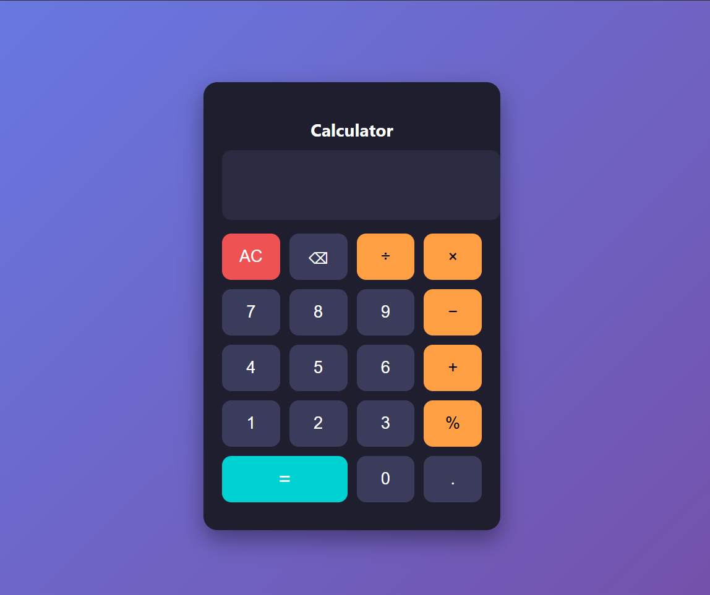

# Calculator Web Application

## Description
This is a simple calculator web application developed using HTML, CSS, and JavaScript.  
It performs basic arithmetic operations such as addition, subtraction, multiplication, and division.

## Features
- User-friendly interface
- Supports basic arithmetic operations
- Clear button to reset calculation
- Responsive design

## Technologies Used
- HTML
- CSS
- JavaScript

## Learning Outcome
- Understanding of DOM manipulation
- Event handling in JavaScript
- Basic UI design using CSS
  
## Project Preview

## How to Run
1. Download the project
2. Open index.html in browser
3. Use calculator

## Author
Saurav Balaso Kolekar
