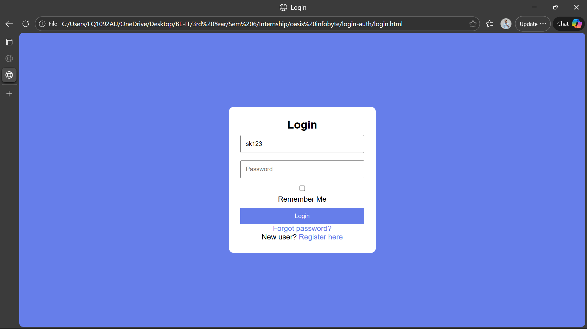
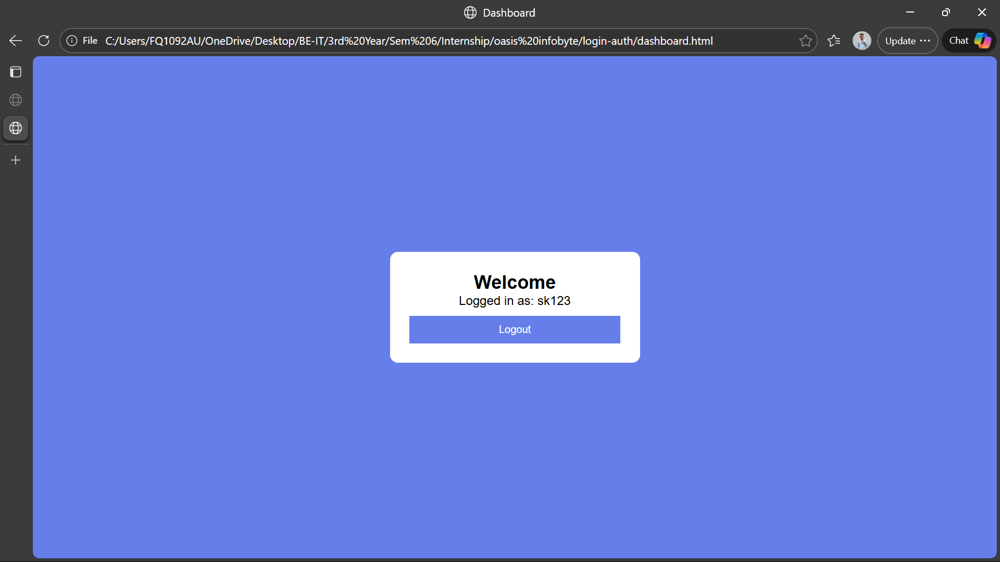

# Login Authentication System

A simple authentication system built using  
HTML, CSS and JavaScript.

---

## 🚀 Features

- User Registration
- Login System
- Dashboard
- Logout
- Remember Me
- Forgot Password
- Show / Hide Password
- LocalStorage based authentication

---

## 📸 Screenshots

  
  

---

## 🛠 Technologies Used

- HTML
- CSS
- JavaScript

---

## ▶ How to Run

1. Open `register.html`
2. Register new user
3. Login
4. Access dashboard

---

## 🎯 Learning Outcomes

- DOM Manipulation
- Event Handling
- Page redirection
- LocalStorage

---

## 👨‍💻 Author

**Saurav Balaso Kolekar**
