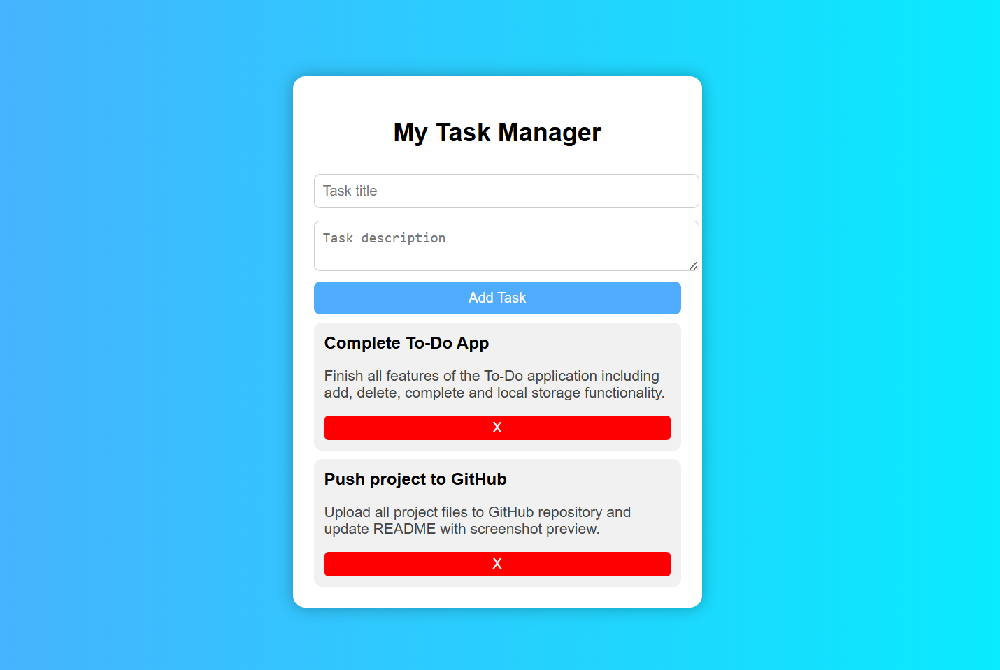

# Smart To-Do Web Application

A simple and user-friendly To-Do List web application built using  
**HTML, CSS, and JavaScript**.

This project was developed as part of my internship task to practice
frontend development and JavaScript concepts.

---

## 🚀 Features

- Add task with **Title & Description**
- Delete tasks
- Mark task as **Completed**
- Data stored using **LocalStorage**
- Clean and modern UI
- Responsive design

---

## 🛠 Technologies Used

- HTML
- CSS
- JavaScript

---

## 📸 Preview

---

## 📂 Project Structure

todo-app/
│── index.html
│── style.css
│── script.js
│── README.md
│── preview.png

---

## ▶ How to Run

1. Download or clone this repository
2. Open `index.html` in browser
3. Start adding tasks

---

## 🎯 Learning Outcomes

- DOM Manipulation
- Event Handling
- LocalStorage
- UI Design

---

## 👨‍💻 Author

**Saurav Balaso Kolekar**  
Web Development Intern  

---

## ⭐ Acknowledgement

Thanks to **Oasis Infobyte** for this learning opportunity.
